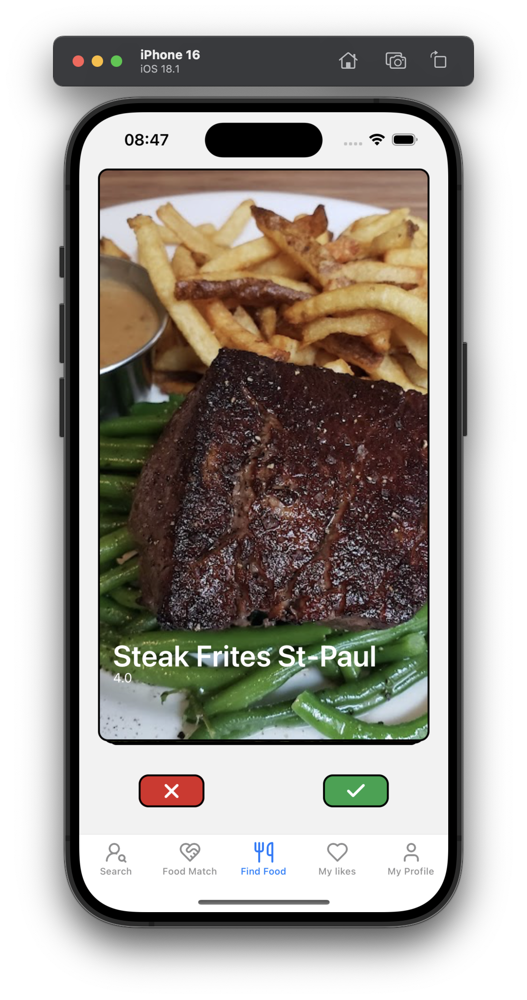
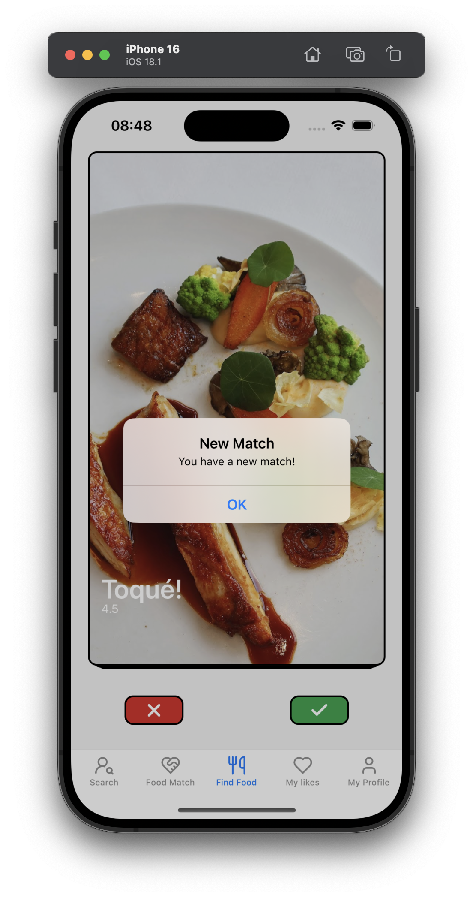
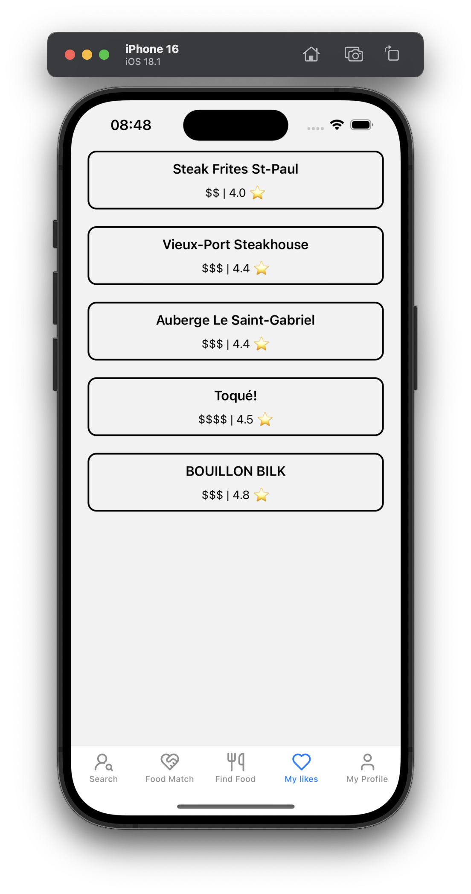

# MealMates 🍽️

MealMates is a mobile application that helps you discover Montreal's vibrant food scene and connect with friends over shared culinary interests. Think Tinder, but for restaurants - swipe through local eateries and match with friends who share your taste!

## Features ✨

- **Restaurant Discovery**: Swipe through curated restaurant images from Montreal's finest establishments
- **Smart Matching**: Get notified when you and your friends like the same restaurants
- **Social Connection**: Follow friends and discover mutual dining interests
- **Personal Collections**: Keep track of restaurants you're interested in visiting
- **Restaurant Details**: View pricing, ratings, and other essential information for each venue

## Screenshots 📱





You can find a video of the app in action [here][website]

[website]: https://www.youtube.com/watch?v=2nAD9EJrNGw

## Tech Stack 🛠️

### Frontend
- React Native
- TypeScript
- NativeWind (Tailwind CSS for React Native)
- Expo.io

### Backend
- Django REST Framework
- SQLite
- Google Maps API

<!-- ## Installation 🚀

1. Clone the repository
```bash
git clone https://github.com/yourusername/mealmates.git
```

2. Install frontend dependencies
```bash
cd mealmates/frontend
npm install
```

3. Install backend dependencies
```bash
cd mealmates/backend
pip install -r requirements.txt
```

4. Set up environment variables
```bash
# Create a .env file in the backend directory with:
GOOGLE_MAPS_API_KEY=your_api_key
```

5. Run the development servers
```bash
# Backend
python manage.py runserver

# Frontend
npm start
```

## Project Structure 📁

```
mealmates/
├── frontend/          # React Native application
│   ├── components/    # Reusable UI components
│   ├── screens/       # Application screens
│   └── services/      # API integration
├── backend/           # Django REST API
│   ├── api/          # API endpoints
│   ├── models/       # Database models
│   └── services/     # Business logic
``` -->

## APIs and Services 🔌

- **Google Maps API**: Used for restaurant data and images
- **Custom REST API**: Handles user authentication, restaurant matching, and social features

## Future Improvements 🚀

- Expand restaurant database beyond Montreal
- Implement an interactive map view of liked restaurants
- Enhanced restaurant recommendation algorithm
- Real-time notifications for matches
- Group matching for larger parties

## Team 👥

Built with ❤️ during CodeJam14 by:
- David Nitchi
- Greta Zu
- Max Fong
- Denis Tsariov

## Contributing 🤝

We welcome contributions to MealMates! Please feel free to submit issues and pull requests.

1. Fork the repository
2. Create your feature branch (`git checkout -b feature/AmazingFeature`)
3. Commit your changes (`git commit -m 'Add some AmazingFeature'`)
4. Push to the branch (`git push origin feature/AmazingFeature`)
5. Open a Pull Request

<!-- ## License 📝

This project is licensed under the MIT License - see the [LICENSE](LICENSE) file for details. -->
